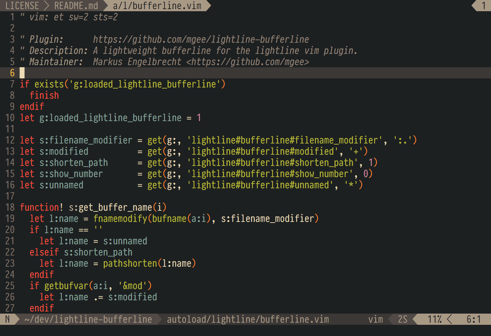

# lightline-bufferline

This plugin provides bufferline functionality for the [lightline](https://github.com/itchyny/lightline.vim) vim plugin.

<p align="center"></p>

## Table Of Contents

- [Installation](#installation)
- [Integration](#integration)
- [Configuration](#configuration)
- [Mappings](#mappings)
- [Example](#example)
- [License](#license)

## Installation

Installation can be easily done with a plugin manager of your choice. For example [vim-plug](https://github.com/junegunn/vim-plug):

```viml
Plug 'mengelbrecht/lightline-bufferline'
```

## Integration

1. Add `'buffers'` to `g:lightline.tabline`.
2. Add `'buffers': 'lightline#bufferline#buffers'` to `g:lightline.component_expand`.
3. Add `'buffers': 'tabsel'` to `g:lightline.component_type`.

The result looks for example like this:

```viml
let g:lightline = {
      \ 'colorscheme': 'one',
      \ 'active': {
      \   'left': [ [ 'mode', 'paste' ], [ 'readonly', 'filename', 'modified' ] ]
      \ },
      \ 'tabline': {
      \   'left': [ ['buffers'] ],
      \   'right': [ ['close'] ]
      \ },
      \ 'component_expand': {
      \   'buffers': 'lightline#bufferline#buffers'
      \ },
      \ 'component_type': {
      \   'buffers': 'tabsel'
      \ }
      \ }
```

If you're adding the buffers to the bottom statusbar, the `modified` indicator will not be updated immediately. To work around this, add this autocmd to your vim config:

```viml
autocmd BufWritePost,TextChanged,TextChangedI * call lightline#update()
```

## Configuration

##### `g:lightline#bufferline#filename_modifier`

The filename-modifier applied to each buffer name. Default is `':.'`.
To see the available options use the command `:help filename-modifiers` in vim.

##### `g:lightline#bufferline#modified`

The indicator to use for a modified buffer. Default is `' +'`.

##### `g:lightline#bufferline#more_buffers`

The indicator to use when there are buffers that are not shown on the bufferline because they didn't fit the available space. Default is `...`.

##### `g:lightline#bufferline#read_only`

The indicator to use for a read-only buffer. Default is `' -'`.

##### `g:lightline#bufferline#shorten_path`

Defines whether to shorten the path using the `pathshorten` function. Default is `1`.

##### `g:lightline#bufferline#show_number`

Defines whether to add the buffer number to the buffer name. Default is `0`.
Valid values are:

- `0`: No numbers
- `1`: Buffer number as shown by the `:ls` command
- `2`: Ordinal number (buffers are numbered from _1_ to _n_ sequentially)
- `3`: Both buffer number and ordinal number next to each other
- `4`: Both buffer number and ordinal number next to each other, where the oridinal number is shown before buffer number

For ordinal number in option `2`, `3` and `4`, number maps `g:lightline#bufferline#number_map` and `g:lightline#bufferline#composed_number_map` are used as described below.

##### `g:lightline#bufferline#composed_number_map`

Dictionary mapping ordinal numbers to their alternative character representations. Default is `{}`.

For example, to use parenthized unicode numbers taken from [Enclosed Alphanumerics Unicode block](https://unicode.org/charts/nameslist/c_2460.html):

```viml
let g:lightline#bufferline#composed_number_map = {
\ 1:  '⑴ ', 2:  '⑵ ', 3:  '⑶ ', 4:  '⑷ ', 5:  '⑸ ',
\ 6:  '⑹ ', 7:  '⑺ ', 8:  '⑻ ', 9:  '⑼ ', 10: '⑽ ',
\ 11: '⑾ ', 12: '⑿ ', 13: '⒀ ', 14: '⒁ ', 15: '⒂ ',
\ 16: '⒃ ', 17: '⒄ ', 18: '⒅ ', 19: '⒆ ', 20: '⒇ '}
```

_Note: The option only applies when `g:lightline#bufferline#show_number` is set to `2` or `3`._

##### `g:lightline#bufferline#number_map`

Fallback dictionary mapping digits (0-9) which are used in ordinal number composing if the number is not mapped in `g:lightline#bufferline#composed_number_map`. Default is `{}`.

For example, to use unicode superscript numerals:

```viml
let g:lightline#bufferline#number_map = {
\ 0: '⁰', 1: '¹', 2: '²', 3: '³', 4: '⁴',
\ 5: '⁵', 6: '⁶', 7: '⁷', 8: '⁸', 9: '⁹'}
```

... or unicode subscript numerals:

```viml
let g:lightline#bufferline#number_map = {
\ 0: '₀', 1: '₁', 2: '₂', 3: '₃', 4: '₄',
\ 5: '₅', 6: '₆', 7: '₇', 8: '₈', 9: '₉'}
```

_Note: The option only applies when `g:lightline#bufferline#show_number` is set to `2` or `3`._

##### `g:lightline#bufferline#number_separator`

Defines the string which is used to separate the buffer number (if enabled) and the buffer name. Default is `' '`.

##### `g:lightline#bufferline#ordinal_separator`

Defines the string which is used to separate the buffer number and the oridinal number. Default is `''`.

##### `g:lightline#bufferline#unnamed`

The name to use for unnamed buffers. Default is `'*'`.

##### `g:lightline#bufferline#enable_devicons`

Enables the usage of [vim-devicons](https://github.com/ryanoasis/vim-devicons) to display a filetype icon for the buffer.
Default is `0`.

##### `g:lightline#bufferline#unicode_symbols`

Use unicode symbols for modified and read-only buffers as well as the more buffers indicator. Default is `0`.

If set to `1` the symbols `+`, `-` and `...` are replaced by `✎`, `` and `…`.

_Note: The symbols are only correctly displayed if your font supports these characters._

##### `g:lightline#bufferline#min_buffer_count`

The minimum number of buffers needed to automatically show the tabline.
When the buffer count falls below this number, the tabline will be hidden once again.
Default is `0` (no auto-show behavior).

##### `g:lightline#bufferline#reverse_buffers`

If enabled the buffers will be displayed in a reversed order.
Default is `0` (buffers are not reversed).

##### `g:lightline#bufferline#right_aligned`

If the bufferline is used in the `right` component of the tabline this should be set to `1` to ensure the correct order of the buffers.
Default is `0`.

##### `g:lightline#bufferline#clickable`

If set to `1` the bufferline is clickable under Neovim versions with `tablineat` feature. To enable this feature, you must also set the bufferline component to be raw in your `vimrc`:

```viml
let g:lightline.component_raw = {'buffers': 1}
```

## Mappings

This plugin provides Plug mappings to switch to buffers using their ordinal number in the bufferline.
To display the ordinal numbers in the bufferline use the setting `g:lightline#bufferline#show_number = 2`.

To use the Plug mappings you can use e.g. these mappings:

```viml
nmap <Leader>1 <Plug>lightline#bufferline#go(1)
nmap <Leader>2 <Plug>lightline#bufferline#go(2)
nmap <Leader>3 <Plug>lightline#bufferline#go(3)
nmap <Leader>4 <Plug>lightline#bufferline#go(4)
nmap <Leader>5 <Plug>lightline#bufferline#go(5)
nmap <Leader>6 <Plug>lightline#bufferline#go(6)
nmap <Leader>7 <Plug>lightline#bufferline#go(7)
nmap <Leader>8 <Plug>lightline#bufferline#go(8)
nmap <Leader>9 <Plug>lightline#bufferline#go(9)
nmap <Leader>0 <Plug>lightline#bufferline#go(10)
```

## Example

The following minimal example adds the bufferline to the lightline tabline and demonstrates a few custom bufferline options:

```viml
let g:lightline#bufferline#show_number  = 1
let g:lightline#bufferline#shorten_path = 0
let g:lightline#bufferline#unnamed      = '[No Name]'

let g:lightline                  = {}
let g:lightline.tabline          = {'left': [['buffers']], 'right': [['close']]}
let g:lightline.component_expand = {'buffers': 'lightline#bufferline#buffers'}
let g:lightline.component_type   = {'buffers': 'tabsel'}
```

## FAQ

**Q:** I can't see the tabline!<br/>
**A:** Add `set showtabline=2` to your configuration. This forces the tabline to always show.

**Q:** My vim GUI (MacVim, gVim, etc.) displays a graphical tabline and not the lightline tabline!<br/>
**A:** Add `set guioptions-=e` to your configuration (and guard it with `if has('gui_running') ... endif`).
This will disable the GUI tabline and enable the lightline tabline.

**Q:** How can I hide the path and show only the filename?<br/>
**A:** Add `let g:lightline#bufferline#filename_modifier = ':t'` to your configuration.

## License

Released under the [MIT License](LICENSE)
